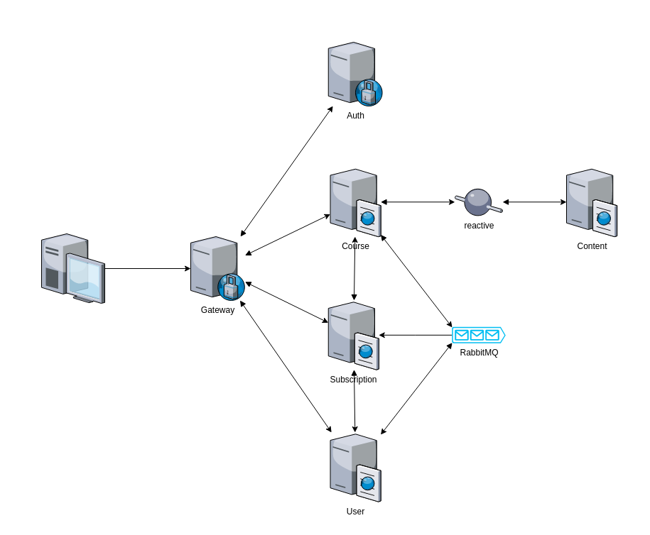

# Microservices with Spring Cloud

Project using Spring Cloud, (zuul and eureka).

* [Microservices](https://medium.com/omarelgabrys-blog/microservices-with-spring-boot-intro-to-microservices-part-1-c0d24cd422c3)
* [Spring Boot Microservices with JWT](https://www.youtube.com/playlist?list=PL62G310vn6nH_iMQoPMhIlK_ey1npyUUl)
* [Microservices communication](https://www.dineshonjava.com/microservices-inter-service-communication/)
    - Basically REST for syncronous call and queues for 
* [Microservices authentication auternatives](https://dzone.com/articles/authentication-and-authorization-in-microservices)
    - In this project we gonna show the "**Global Authentication and Authorization as a part of Microservices**" 

